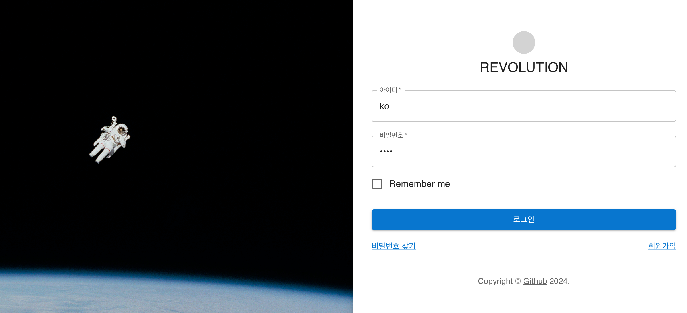
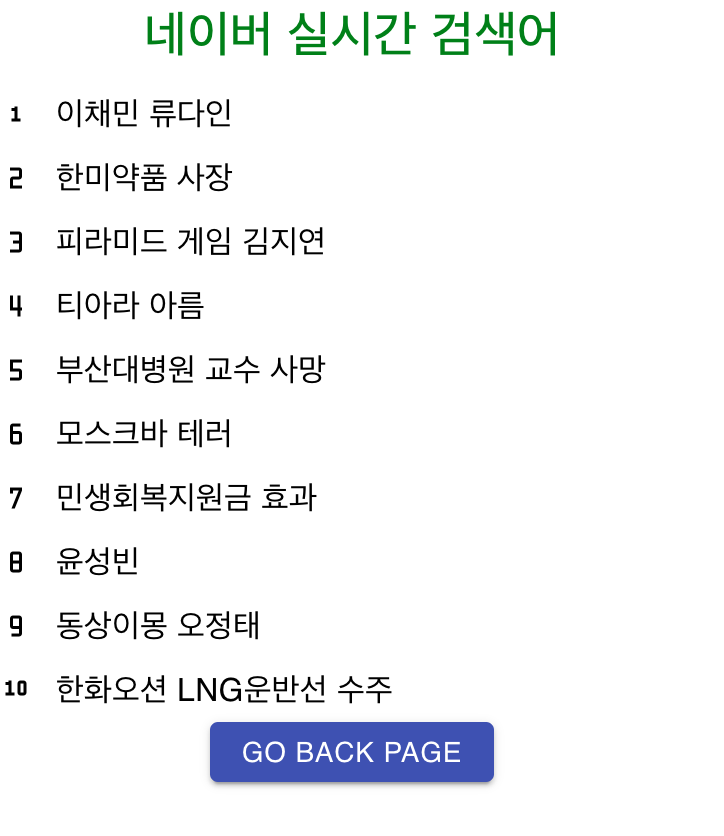
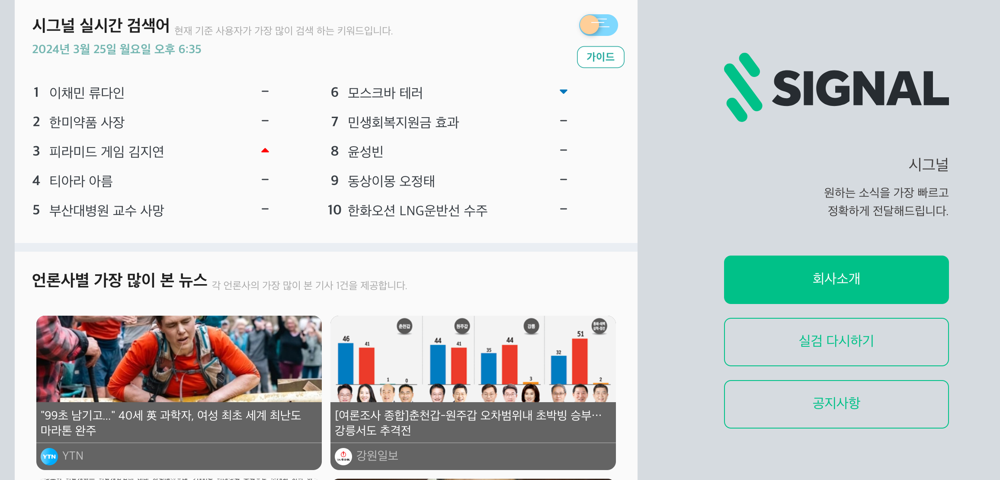

# Getting Started with Create React App

## 1. 프로젝트 요약
- 로그인 기능 (design ref - https://mui.com/material-ui/getting-started/templates/)
- front(react) - Back(spring boot) 연동
- 네이버 실시간 크롤링 (selenium)
  - Quartz Scheduler로 자동화


## 2. 개발 환경
- Java 11
- SringBoot 2.7.4
- React
- MYSQL 8.0


## 3. 사용 방법 

- Project Settings

```
현재 프로젝트는 chrome versions 123.0.6167.160 사용 (사용하는 chrome version에 맞는 driver 설치하세요)
- chromedriver를 다운로드 후 프로젝트 경로 안에 파일을 이동

- `mac에서 개발자를 확인할 수 없기 때문에 ‘chromedriver’을(를) 열 수 없습니다.` 오류가 발생하는 경우
  - cd /path/to/chromedriver
  - chmod +x chromedriver
```
[chromedriver 다운로드 링크](https://googlechromelabs.github.io/chrome-for-testing/#stable)
<br><br>

- How to run the application
```
Front-end (React)
- cd path/to/frontend
- npm install
- npm start
```

```
Back-end (Spring Boot)
- "/path/to/build/libs" java -jar toy-react-java-0.0.1-SANPSHOT.jar
```

```angular2html
MySql
- docker 혹은 local에 mysql 설치
- application.properties에 설정한 정보 입력
```

--------------

### 프로젝트 화면 예시

- 로그인 화면 (http://localhost:3000)



- 로그인 성공 (http://localhost:3000/board)



- 크롤링 작업 화면 (서버 구동시, 3분마다[Quartz Scheduler에서 변경])



## Notice
- 로그인 기능만 구현 
- 회원가입 로직은 아직 미완성으로 DB에 User 정보를 넣어서 Test

## Author
- [gominnam](https://github.com/gominnam) - **MinJun KO** - <kosok03@naver.com>

